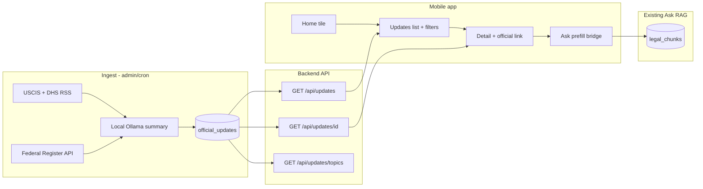

# Official Updates — feature documentation

**Branch:** `feature/official-updates` (for Rishi review — **do not merge to `main` until approved**)

**Product pillar:** Home → Ask | Scenario Guides | **Official updates**

This document describes how Official Updates works end-to-end: data model, ingest, API, mobile UI, topic filters, Ask bridge, privacy, and operations.

---

## 1. What it is (and is not)

### Purpose

- Surface **recent government immigration announcements** (USCIS, DHS, Federal Register) in **plain language**.
- Help users **discover** what agencies published, then **open the official release** or **ask** how similar topics are treated in **statutes, regulations, and USCIS Policy Manual** sources already in the app.

### What it is not

- **Not legal advice** — summaries are informational; users must verify on official links.
- **Not part of RAG ground truth by default** — rows live in `official_updates`, separate from `legal_chunks`. Ask answers still come from retrieved legal sources, not press release text.
- **Not personalized news feeds** — no user-specific ranking, no third-party news APIs, no storing user reading history on the server.

---

## 2. Architecture overview



---

## 3. Database

**Migration:** `database/migrations/003-official-updates.sql`

| Column | Type | Notes |
|--------|------|--------|
| `id` | BIGSERIAL | Primary key |
| `publisher` | TEXT | `uscis`, `dhs`, `federal_register` |
| `external_id` | TEXT | RSS guid or FR document number |
| `title` | TEXT | Announcement title |
| `official_url` | TEXT | User-facing official link |
| `published_at` | TIMESTAMPTZ | Sort key (newest first) |
| `raw_excerpt` | TEXT | Optional stripped RSS/abstract excerpt |
| `summary_bullets` | JSONB | Exactly 3 plain-language bullets |
| `topic_tags` | TEXT[] | Fixed enum ids (see §5) |
| `content_hash` | TEXT | SHA-256 of title+url+excerpt for change detection |
| `summary_model` | TEXT | Ollama model name or null if fallback |
| `fetched_at` | TIMESTAMPTZ | Last ingest touch |
| `is_published` | BOOLEAN | Default TRUE |

**Unique constraint:** `(publisher, external_id)`

**Indexes:** `published_at DESC`, GIN on `topic_tags`

Apply:

```bash
psql "$DATABASE_URL" -f database/migrations/003-official-updates.sql
```

(`*.sql` may be gitignored locally; use `git add -f` when committing the migration.)

---

## 4. Ingest (backend services + scripts)

### Whitelisted sources (v1)

| Publisher | Source |
|-----------|--------|
| `uscis` | `https://www.uscis.gov/news/rss/news-releases` |
| `dhs` | `https://www.dhs.gov/news-releases/rss.xml` |
| `federal_register` | Federal Register API — USCIS agency + immigration term |

Implementation: `backend/app/services/official_updates_feeds.py`

- HTTP User-Agent identifies the app; failures per source are skipped (partial ingest).
- HTML stripped from excerpts; max ~1200 chars.

### Summaries (local LLM only)

`backend/app/services/official_updates_summary.py`

- **Ollama** (same config as chat: `OLLAMA_*` in `backend/.env`).
- System prompt: 3 bullets, 6th-grade reading level, no legal advice, JSON `{"bullets":[...]}`.
- On failure or thin excerpt: **template fallback** bullets (no cloud APIs).

### Topic tagging (rule-based, not LLM)

`backend/app/services/official_updates_topics.py`

- Fixed **12 topic ids** + `general`.
- Regex keyword rules on title + excerpt at ingest.
- If no rule matches → `general` only.

### Scripts

| Script | Purpose |
|--------|---------|
| `review/scripts/ingest_official_updates.py` | Fetch feeds, summarize, upsert |
| `review/scripts/seed_official_updates_demo.py` | 3 demo rows without network |

Examples:

```bash
# Preview feed items (no DB)
uv run --project backend python review/scripts/ingest_official_updates.py --dry-run

# Full ingest (needs migration + DATABASE_URL + Ollama for summaries)
uv run --project backend python review/scripts/ingest_official_updates.py

# Fast local test without Ollama
uv run --project backend python review/scripts/ingest_official_updates.py --skip-llm --limit 5

# Demo seed for mobile QA
uv run --project backend python review/scripts/seed_official_updates_demo.py
```

**Upsert logic:** `backend/app/services/official_updates_service.py` — insert on new `(publisher, external_id)`; otherwise update row (re-fetch refreshes `fetched_at` and content).

---

## 5. Topic filters (10/10 behavior)

### Topic enum (fixed)

| id | Label |
|----|--------|
| `general` | General |
| `f1_j1` | F-1 / J-1 students |
| `h1b` | H-1B & work visas |
| `family` | Family immigration |
| `asylum` | Asylum & protection |
| `tps` | TPS & humanitarian |
| `green_card` | Green card |
| `citizenship` | Citizenship |
| `ead_work` | Work permits (EAD) |
| `enforcement` | Enforcement & courts |
| `fees_forms` | Fees & forms |
| `visa_bulletin` | Visa bulletin |

### List filtering (API + mobile)

- **All** = no `topics` query param → returns every published row (newest first).
- **One or more topics** = `GET /api/updates?topics=f1_j1,h1b` → SQL `topic_tags && ARRAY[...]` (overlap: item matches if it has **any** selected tag).
- Unknown topic ids in the query string are **ignored**.

### Mobile persistence (guest-safe)

- Selected topic chips saved in **AsyncStorage** only: `@sourcepath/official_update_topic_filters`
- Never sent to server except as the optional `topics` filter on list fetch.
- **All** chip clears storage and removes API filter.

---

## 6. HTTP API

**Router:** `backend/app/api/routes/official_updates.py`  
**Prefix:** `/api/updates`

| Method | Path | Description |
|--------|------|-------------|
| GET | `/api/updates/topics` | Full topic catalog for filter chips |
| GET | `/api/updates` | Paginated list (`topics`, `limit`, `offset`) |
| GET | `/api/updates/{id}` | Detail + `ask_prefill_message` |

### List response (shape)

- `items[]`: id, publisher, title, official_url, published_at, summary_bullets, topic_tags, topic_labels, fetched_at, has_official_excerpt
- `total`, `count`, `limit`, `offset`, `topics_filter`
- `privacy_mode`: `local-first`

### Detail — Ask prefill

Query: `ask_topic` (optional) — user's active filter for button copy context.

`ask_prefill_message` instructs the model to answer from **legal DB sources only**, cites the announcement title/date/link for the user, and names the topic (e.g. "H-1B & work visas").

**Privacy:** Prefill is built in the API response; **not stored** in DB or logs.

### Errors

| Code | When |
|------|------|
| `503 UPDATES_NOT_READY` | `official_updates` table missing |
| `404 UPDATE_NOT_FOUND` | Invalid id or unpublished |

---

## 7. Mobile app

### Navigation

- Home **Official updates** tile → `/(main)/updates`
- Card tap → `/(main)/updates/[id]`
- **Read official release** → `Linking.openURL(official_url)`
- **Ask how this affects my situation** → `/(main)/ask?prefill=...` (composer prefilled, user sends manually)

### Files

| Area | Path |
|------|------|
| List screen | `mobile/app/(main)/updates.tsx` |
| Detail screen | `mobile/app/(main)/updates/[id].tsx` |
| API client | `mobile/src/lib/updatesApi.ts` |
| Topic prefs | `mobile/src/lib/updateTopicPrefs.ts` |
| Types | `mobile/src/types/updates.ts` |
| UI | `mobile/src/components/updates/*` |
| Ask bridge | `mobile/app/(main)/ask.tsx` (`prefill` param) |
| Home entry | `mobile/src/components/home/HomeExploreSection.tsx` |
| Stack | `mobile/app/(main)/_layout.tsx` |

### UX copy (required disclaimers)

- List + detail: short **not legal advice** disclaimer.
- Detail: note that Ask uses **statutes/regulations/policy manual**, not the press release.
- Primary CTA: **Read official release** (external browser).

### Backend URL

Set `EXPO_PUBLIC_API_BASE_URL` in `mobile/.env` (see `mobile/src/constants/api.ts`).

---

## 8. Privacy & security

| Rule | Implementation |
|------|----------------|
| No full Q&A in updates flow | Ask unchanged; prefill only in mobile memory |
| Summaries at ingest only | Not regenerated per user request |
| Local LLM for summaries | `official_updates_summary.py` → Ollama only |
| Whitelist URLs | RSS/API constants in `official_updates_feeds.py` |
| Separate table | No automatic insert into `legal_chunks` |
| Guest topic prefs | AsyncStorage on device |

---

## 9. Testing checklist (Rishi)

1. Apply migration `003-official-updates.sql`.
2. `seed_official_updates_demo.py` OR `ingest_official_updates.py --skip-llm`.
3. Start backend: `uv run uvicorn app.main:app --reload --host 0.0.0.0 --port 8000` (from `backend/`).
4. `curl http://127.0.0.1:8000/api/updates/topics`
5. `curl http://127.0.0.1:8000/api/updates`
6. `curl http://127.0.0.1:8000/api/updates/1`
7. Mobile: open Official updates, toggle topic filters (restart app — filters persist).
8. Open detail → official link opens browser.
9. Ask bridge → composer prefilled → send → answer cites legal chunks, not press release.

**Unit tests:**

```bash
cd backend && uv run python -m unittest tests.test_official_updates_topics -v
```

---

## 10. Operations (future)

- **Cron:** run `ingest_official_updates.py` daily; monitor row counts and Ollama availability.
- **Optional:** extend `/health/schema` with optional `official_updates` presence (not required for MVP schema).
- **Future v2:** admin unpublish (`is_published=false`), content_hash-only summary refresh, push notifications (out of scope v1).

---

## 11. File index (this feature)

**Backend**

- `backend/app/api/routes/official_updates.py`
- `backend/app/schemas/official_updates.py`
- `backend/app/services/official_updates_{feeds,service,summary,topics}.py`
- `backend/tests/test_official_updates_topics.py`

**Database**

- `database/migrations/003-official-updates.sql`

**Scripts**

- `review/scripts/ingest_official_updates.py`
- `review/scripts/seed_official_updates_demo.py`

**Mobile**

- `mobile/app/(main)/updates.tsx`, `updates/[id].tsx`
- `mobile/src/lib/updatesApi.ts`, `updateTopicPrefs.ts`
- `mobile/src/components/updates/*`

**Docs**

- `docs/official-updates.md` (this file)
